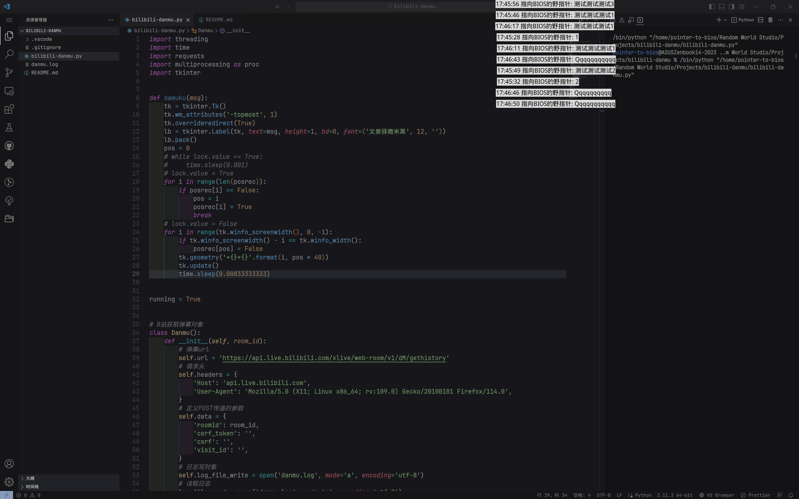

# Bilibili Danmu

B站直播弹幕工具

直播间号码在文件`bilibili-danmu.py`的第十行处修改。

修改后才可以安装。

## Linux使用说明

安装：

```bash
sudo make install
```

卸载：

```bash
sudo make uninstall
```

想停止弹幕姬只能在进程管理器中杀死。

## Windows使用说明

将文件后缀名改为`pyw`后双击运行，停止弹幕姬同上。

## 演示


